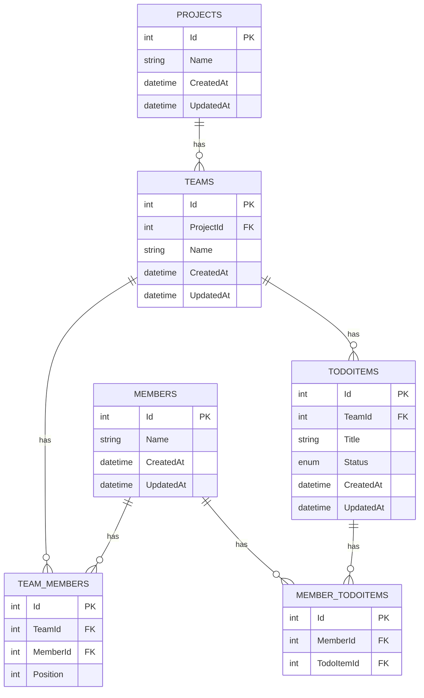

## ER図
### 前提
- 既存のTodoアプリに対して、Project、Team、Memberの概念を追加する
- Project配下にTeamがある。
- Memberは複数のTeamに属することができる構成とする。
- Memberは複数のTodoItemを持つことができ、TodoItemは複数のMemberを持つことができる構成とする。
- TodoItemはTeamに属するMemberに紐づく。

### 各テーブルの意味合い
- PROJECTS：プロジェクトの情報を保持
- TEAMS   ：チームの情報を保持
- MEMBERS ：メンバーの情報を保持
- TODOITEMS　：タスクの内容を保持
- TEAM_MEMBERS　：TeamとMemberの多対多の所属関係を管理する中間テーブル
- MEMBER_TODOITEMS　：MemberとTodoItemの多対多の紐づき関係を管理する中間テーブル

### IDとStutasの型考察

#### Idの選択肢
- string
    - 独自のIDを発行できる
    - 採番ルールなどを自力で考える必要がある
- BIGINT
    - intより多くのIDを採番できる
    - そこまで大量のデータを扱うことを想定していない場合intで事足りる
- UUID
    - 分散システムでIDがしにくい。
    - データが重くなってしまう。
- int　→ 今回に関してはデメリットが大きく影響しないので「int」を採用
    - 自動採番され、実装や確認がシンプル
    - 連番IDのため、URLなど外部に露出した場合にそこから、会員数や件数などが推測されてしまう

#### statusの選択肢
- string
    - 取得したデータの内容がDB上でも取得した時点でもわかりやすい
    - 表記揺れが発生する可能性がある。
- bool
    - 完了/未完了のように単純な二択で実装することができる
    - 複雑なステータス管理ができない。
- int
    - 表記揺れ等の心配もなく、コード側での状態の管理がしやすい

    - DB上の値とコード上の定義で管理場所が分散する
    - そのため、enumの定義変更によって既存データとの対応が崩れるリスクがある
- enum　→ 種類に変更が加わる可能性が低く、他の型のデメリットが大きいので「enum」を採用
    - コード上で扱う値を制限できる
    - 後からenumに変更を加えるときにコード変更が必要になる

#### ユニーク制約をつけるべきカラム
- PROJECTS
    - Name
        - 同名プロジェクトを作成しないようにする。プロジェクトのステータスをつける場合は再検討する。
- TEAMS
    - ProjectIdとNameの組み合わせ
        - 同一プロジェクト内でのみ同じ名前を使わないようにする。
- MEMBERS
    - 同姓同名が登録される可能性はあるので制約をつける対象は無し。

- TODOITEMS
    - タスクの内容によってはチーム内でも重複する可能性があるので制約をつける対象はなし。

- TEAM_MEMBERS
     - TeamIdとMemberIdの組み合わせ
        - チームとメンバーの組み合わせを重複させないようにする。

- MEMBER_TODOITEMS
    - MemberIdとTodoItemIdの組み合わせ
        - メンバーとタスクの組み合わせを重複させないようにする。

